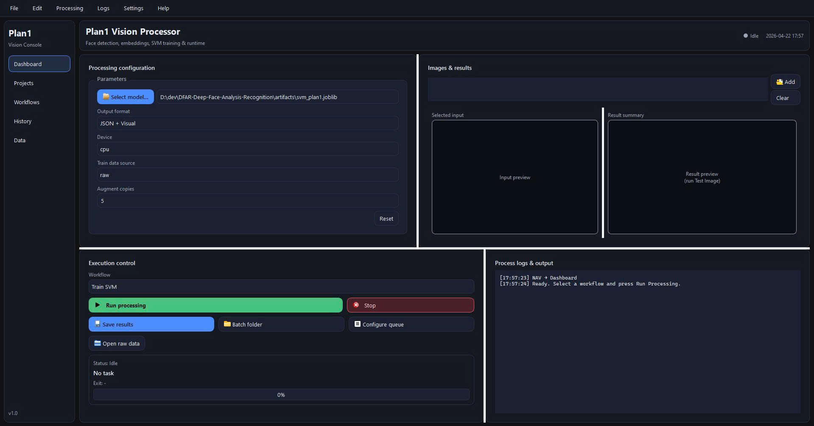

# DFAR - Deep Face Analysis & Recognition

End-to-end face recognition pipeline for attendance and identity verification, built with a practical hybrid stack:

- `facenet-pytorch` MTCNN for face detection
- `dlib` ResNet (128-D) for face embeddings
- `scikit-learn` Linear SVM for classification + threshold-based unknown rejection
- Optional PySide6 desktop UI and FastAPI service for deployment workflows

---

## Abstract

This project provides a production-oriented face recognition workflow from data preparation to inference. It supports:

- dataset ingestion and augmentation
- GPU-aware training with progress and metrics
- image and webcam inference
- API-based recognition endpoint
- desktop launcher for non-CLI operation

The design is lightweight, modular, and suitable for internal attendance systems, PoCs, and edge-style deployments.

---

## Core Functions

- **Data Preparation**
  - Load labeled images from `data/raw/<employee_id>/*`
  - Optional augmentation to `data/aug/<employee_id>/*`
  - Optional sample dataset downloader (LFW) in project format

- **Training**
  - Detect face -> embed -> train Linear SVM
  - Threshold calibration from validation margins
  - Training logs include:
    - device info (CPU/CUDA + GPU name)
    - dataset/image/class counts
    - progress bar for extraction
    - metrics (train/val accuracy, hinge loss, averages)

- **Inference**
  - Single-image recognition (`test_image.py`)
  - Realtime webcam demo (`demo_webcam.py`)
  - Unknown/reject logic via threshold (`below_threshold`)

- **Service Layer**
  - FastAPI endpoint for uploaded image recognition
  - Optional event persistence to SQLite

- **Desktop UI**
  - Responsive 4-panel operational console
  - Model selection, workflow execution, logs, previews
  - Includes placeholder controls for future expansion

---

## Project Structure

```text
DFAR-Deep-Face-Analysis-Recognition/
├─ plan1_app/
│  ├─ detection/           # MTCNN wrapper
│  ├─ embedding/           # dlib embedder
│  ├─ classification/      # SVM train/predict
│  ├─ pipeline/            # end-to-end recognizer
│  └─ integration/         # FastAPI + DB integration
├─ scripts/
│  ├─ download_models.py
│  ├─ download_sample_dataset.py
│  ├─ augment_dataset.py
│  ├─ train_svm.py
│  ├─ test_image.py
│  ├─ demo_webcam.py
│  ├─ run_api.py
│  └─ ui_launcher_qt.py
├─ ui_qt/                  # PySide6 launcher UI
├─ data/
│  ├─ raw/
│  └─ aug/
└─ artifacts/              # trained SVM artifacts
```

---

## WorkFlow

1. Download required dlib models
2. Prepare dataset (`data/raw/<employee_id>/*.jpg`)
3. Train SVM artifact
4. Test on single image
5. Run webcam demo or API
6. (Optional) Use Qt UI for end-to-end operation

---
## GUI demo

---
## Installation

### 1) Create/activate environment

Use your preferred Python env (venv/conda). Then install dependencies:

```bash
pip install -r requirements.txt
```

### 2) (Windows + NVIDIA) Install CUDA-enabled PyTorch wheels

`pip install -r requirements.txt` may install CPU wheels by default. For CUDA:

```bash
pip install torch==2.2.2+cu121 torchvision==0.17.2+cu121 torchaudio==2.2.2+cu121 --index-url https://download.pytorch.org/whl/cu121
```

---

## Usage

### A. Download dlib model files (required)

```bash
python scripts/download_models.py
```

This fetches:

- `models/shape_predictor_68_face_landmarks.dat`
- `models/dlib_face_recognition_resnet_model_v1.dat`

### B. Prepare dataset

Expected layout:

```text
data/raw/
  employee_001/
    img1.jpg
    img2.jpg
  employee_002/
    ...
```

Optional: Download sample LFW dataset in project format:

```bash
python scripts/download_sample_dataset.py --min-faces-per-identity 20 --per-identity-limit 30
```

Optional: Data augmentation

```bash
python scripts/augment_dataset.py --source data/raw --out data/aug --copies 5
```

### C. Train model

```bash
python scripts/train_svm.py --device cuda
```

Output:

- `artifacts/svm_plan1.joblib`
- `artifacts/svm_plan1.meta.json`

### D. Test a single image

```bash
python scripts/test_image.py --image path/to/test.jpg --artifact artifacts/svm_plan1.joblib --device cuda
```

### E. Webcam demo

```bash
python scripts/demo_webcam.py --artifact artifacts/svm_plan1.joblib --device cuda
```

Press `q` to exit.

### F. Run API server

```bash
python scripts/run_api.py
```

Health check:

- `GET /health`

Recognition endpoint:

- `POST /recognize_upload` (multipart image)

Optional environment variables:

- `PLAN1_SVM_PATH` (artifact path)
- `PLAN1_DEVICE` (`cpu` or `cuda`)
- `PLAN1_DB_PATH` (sqlite path)

### G. Run Qt UI

```bash
python scripts/ui_launcher_qt.py
```

---

## Recognition Output Contract

Typical inference result fields:

- `ok`: whether recognition accepted a match
- `reason`: `match`, `below_threshold`, `no_face`, `embed_failed`
- `employee_id`: predicted label or `null`
- `margin`: SVM margin score
- `det_prob`: detector confidence
- `box`: face bounding box

---

## Notes & Best Practices

- Full-body photos are acceptable as long as face is visible and large enough.
- Retraining is required when adding new employee classes to SVM.
- For best quality:
  - multiple images per person
  - varied poses/lighting
  - minimal blur/occlusion
- Keep model files and artifacts out of git when needed (`.gitignore`).

---

## Roadmap Ideas

- Incremental enrollment without full retrain
- Confidence calibration (Platt/isotonic)
- Richer UI preview overlays
- Batch evaluation reports (per-class precision/recall/F1)
- Model versioning and artifact registry

